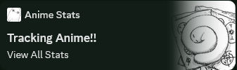
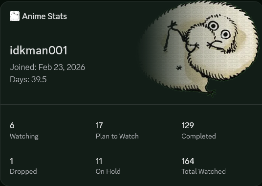

  
  
  
  

  <h1 align="center">📺 MyAnimeList to Discord Widget Sync</h1>
  

    <b>A lightweight, automated Node.js service that synchronizes your public MyAnimeList anime statistics directly to your custom Discord application profile widget.</b>
  

  
  ---

 

<h2 align="center">📋 System Requirements</h2>

<table align="center" width="100%">
  <thead>
    <tr align="left">
      <th width="30%">Item</th>
      <th width="70%">Specification</th>
    </tr>
  </thead>
  <tbody>
    <tr>
      <td><b>Runtime Environment</b></td>
      <td><code>Node.js 22</code> or newer (with <code>npm</code>)</td>
    </tr>
    <tr>
      <td><b>Source Profile</b></td>
      <td>Any public <b>MyAnimeList</b> profile username</td>
    </tr>
    <tr>
      <td><b>Target Destination</b></td>
      <td>A <b>Discord developer application</b> profile widget layout</td>
    </tr>
  </tbody>
</table>

 

<h2 align="center">⚙️ Setup & Installation</h2>

Follow these three simple steps to install and start the synchronization loop:

<ol>
  <li>
    <b>Install dependencies:</b>
    <pre><code>npm install</code></pre>
  </li>
  <li>
    <b>Configure environment variables:</b>
    
Create a file named <code>.env</code> in the root directory and copy the contents below (replacing them with your credentials):

    <pre><code>MAL_USERNAME=your_mal_username
MAL_CLIENT_ID=your_mal_client_id
DISCORD_BOT_TOKEN=your_discord_bot_token
APPLICATION_ID=your_discord_application_id
DISCORD_USER_ID=your_discord_user_id</code></pre>
  </li>
  <li>
    <b>Run the synchronization:</b>
    <pre><code>node sync.js</code></pre>
  </li>
</ol>

 

<h2 align="center">🌐 Environment Variables</h2>

<table align="center" width="100%">
  <thead>
    <tr align="left">
      <th width="25%">Variable Name</th>
      <th width="15%">Required</th>
      <th width="60%">Description</th>
    </tr>
  </thead>
  <tbody>
    <tr>
      <td><code>MAL_USERNAME</code></td>
      <td><b>Yes</b></td>
      <td>Your public MyAnimeList profile username.</td>
    </tr>
    <tr>
      <td><code>MAL_CLIENT_ID</code></td>
      <td>No</td>
      <td>Included for compatibility with standard Discord widget setups.</td>
    </tr>
    <tr>
      <td><code>DISCORD_BOT_TOKEN</code></td>
      <td><b>Yes</b></td>
      <td>Your Discord bot token (used to authenticate API requests).</td>
    </tr>
    <tr>
      <td><code>APPLICATION_ID</code></td>
      <td><b>Yes</b></td>
      <td>Your Discord Developer Application ID.</td>
    </tr>
    <tr>
      <td><code>DISCORD_USER_ID</code></td>
      <td><b>Yes</b></td>
      <td>Your numeric Discord User ID (non-digits are automatically stripped).</td>
    </tr>
  </tbody>
</table>

 

<h2 align="center">⚡ Easy Discord Portal Setup</h2>

  Skip building your widget layout manually in the Discord Developer Portal. Use the included <code>discord_portal.json</code> layout file with the <a href="https://github.com/ItzMeShadow999/Discord_Widget_Configurator" target="_blank">Discord Widget Configurator</a> utility to import configuration in seconds.

<table align="center" width="100%">
  <thead>
    <tr align="left">
      <th width="30%">Widget Surface</th>
      <th width="70%">Rendered Fields</th>
    </tr>
  </thead>
  <tbody>
    <tr>
      <td><b>Upper Widget Banner</b></td>
      <td><code>username</code>, <code>joindate</code>, <code>dayswatched</code></td>
    </tr>
    <tr>
      <td><b>Statistics Grid</b></td>
      <td><code>watching</code>, <code>plantowatch</code>, <code>completed</code>, <code>dropped</code>, <code>onhold</code>, <code>totalwatched</code></td>
    </tr>
  </tbody>
</table>

 

<h2 align="center">🖼️ Widget Showcase</h2>

  <table border="0" cellspacing="10" cellpadding="0" align="center">
    <tr>
      <td align="center" valign="top">
        <h4>Compact Preview</h4>
        
      </td>
      <td align="center" valign="top">
        <h4>Full Widget Layout</h4>
        
      </td>
    </tr>
  </table>

 

<h2 align="center">💡 Important Notes</h2>

<ul>
  <li><b>Sync Interval:</b> The script runs synchronization immediately on startup and repeats automatically every 15 minutes.</li>
  <li><b>Source API:</b> Data is retrieved from the public MyAnimeList profile using the open-source <a href="https://jikan.moe" target="_blank">Jikan API v4</a>.</li>
  <li><b>Security Alert:</b> Never share or commit your <code>.env</code> file or raw credentials.</li>
  <li><b>Credits & Inspiration:</b> Inspired by the Python version <a href="https://github.com/7Games/mal-discord-widget" target="_blank">mal-discord-widget</a>. Developed with AI documentation assistance.</li>
</ul>

 

  
Released under the <a href="LICENSE">MIT License</a>.

